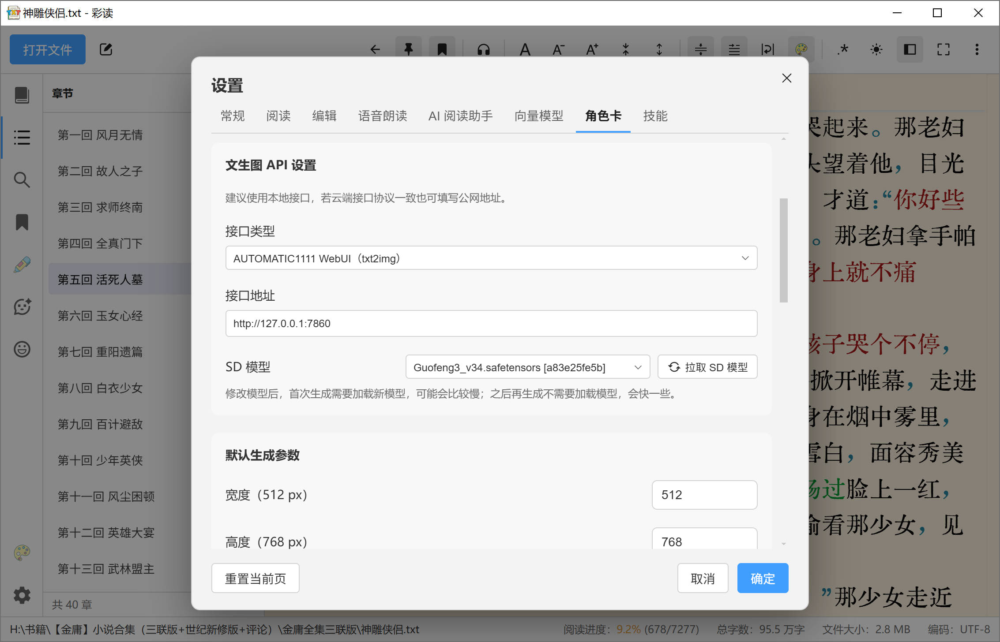

## 示例图

### 文件列表

### 章节列表

### 暗色模式

### 全文搜索

### 书签列表

### 高亮词

### AI阅读助手

#### 分析剧情

#### 生成章节匹配规则

#### 生成思维导图

#### 生成词云图

### 角色卡

#### 3D 闪卡效果

#### AI 检索角色信息

#### 生成角色立绘

### 语音朗读

### 章节匹配规则

### 配色

### 设置

