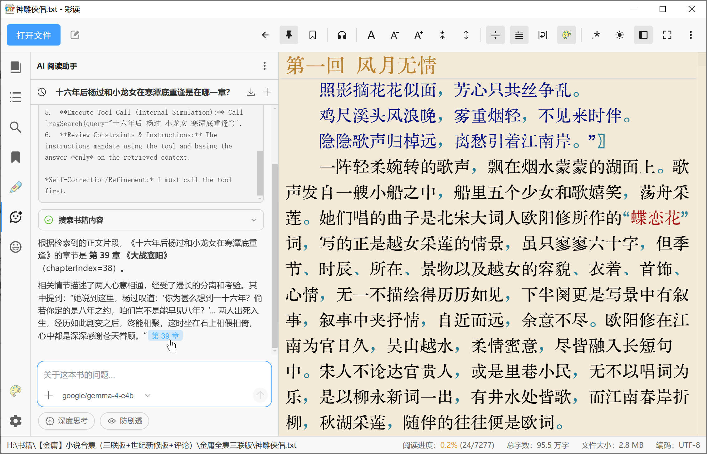

<h1>
  

     彩读｜ColorTxt 3.0 书源 × AI+
  

</h1>

  
  
  

  <strong>一款会给内容上色的本地 TXT 小说阅读器，带给你不一样的阅读体验！</strong>

还有章节识别、简繁互转、划线标注、记笔记、多角色语音朗读、AI 阅读助手、书源找书等功能。

  

## 功能特性 [[预览图](./IMAGES.md)]

|  | 功能 | 说明 |
| :---: | --- | --- |
|  | 本地文件阅读 | 支持本地 `.txt`／`.md` 文件 |
|  | 其他电子书 | 支持常见的电子书格式（如 `.epub`），打开时会转换为 `.md` 进行加载 |
|  | 自动编码识别 | `UTF-8` 和 `ANSI` 都能正常打开 |
|  | 自动章节识别 | 内置常用的章节匹配规则，也支持自定义匹配规则 |
|  | **个性内容上色** | 使用一套自定义的高亮规则对内容进行着色，带来 **独特的阅读体验**！ |
|  | **自定义高亮词** | 可选择任意词语进行高亮显示（可用于突出主要角色、关键词语等） |
|  | **自定义配色** | 可定制阅读区、高亮词、划线标注的配色 |
|  | 书签 | 可添加带备注的书签 |
|  | **划线笔记** | 可选中文本进行划线标注、记笔记 |
|  | **编辑模式** | 方便对小说内容进行修改（_错别字坚决不能忍！_） |
|  | 定时滚动 | 定时滚动一屏或一行 |
|  | **语音朗读** | 支持旁白／对白多音色，配合 AI + 角色卡可实现多角色语音朗读 |
|  | **文本替换** | 全局替换文本（可用于替换人名、去广告文本等） |
|  | **简繁互转** | 简繁互转，字母／数字全半角互转 |
|  | **AI 阅读助手** | 可以让 **AI** 帮忙分析剧情、回答小说相关问题（支持生成  **思维导图**／ **词云图**） |
|  | **角色卡生成** | 借助 **AI** 检索小说中角色的相关信息生成摘要，通过 **文生图** 生成角色立绘 |
|  | **AI 智能排版** | 让 **AI** 对文本进行排版，可自动处理硬换行、修正标点符号等 |
|  | 书源找书 | 可多源搜索，支持在线阅读或整书下载 |
|  | 空行压缩 | 压缩多余空行 |
|  | 行首缩进 | 在行首添加全角缩进 |
|  | 文件列表 | 拖放添加文件／目录（会递归读取子目录），支持分类／排序／过滤 |
|  | 全文搜索 | 检索所有匹配项并给出结果列表（区别于阅读区的逐个查找） |
|  | 字体／字号／行高 | 内置 `京華老宋体`，也可以选择系统中安装的任意字体 |
|  | 主题切换 | 内置明亮／暗黑两种主题 |
|  | 全屏阅读 | **沉浸式阅读体验**，阅读区域宽度可自由调整 |
|  | 粘性标题栏 | 章节标题会常驻顶部，看到哪里一目了然 |
|  | 阅读进度恢复 | 自动记录阅读进度，下次打开可以继续阅读 |
|  | 最近打开记录 | 记录最近打开的文件 |
|  | **摸鱼快捷键** | 摸鱼时可以快速隐藏阅读器 |
|  | 多窗口 | 支持同时打开多个窗口 |

### 关于「其他电子书格式」的支持

支持打开 `.md` 文件，章节按 ATX `#` 标题识别，章节列表按标题层级缩进。

> 说明：只支持标题、链接、图片等少量 Markdown 语法，服务于小说文本。

支持打开常见的电子书格式（`.epub`/`.mobi`/`.azw3`/`.fb2`/`.fbz`/`.pdf`/`.chm`），打开时会转换为 `.md` 进行加载。

> 说明：会舍弃掉电子书自带的样式，只提取里面的文本进行展示。

### 关于「摸鱼快捷键」

「摸鱼快捷键」可以快速隐藏阅读器，包括窗口、任务栏按钮（Windows）、程序坞图标（macOS），让摸鱼更安全。

默认的快捷键是 `Ctrl`+`` ` ``，你也可以在「快捷键」面板中自定义。

在 macOS 上，要隐藏程序坞图标，需要在 `系统设置` -> `桌面与程序坞` 中关掉 `在程序坞中显示建议App和最近使用的App`。

> 已知问题：在 Linux Wayland 上，全局快捷键会失效，这个暂时没有解决办法。

### 关于「高级换行策略」

阅读器默认使用一套比较简单的换行算法，效率高，但不够准确，会出现该换行却没有换行的情况。这个问题连 VSCode 都没能完美解决。

「高级换行策略」则使用了一套更复杂的算法，能有效提高换行的准确性，但性能较差。当要处理的文件比较大时，会出现明显卡顿，要等计算完才能恢复。

所以在做一些会影响布局的操作时（比如修改文字格式、调整窗口大小等），建议先关掉「高级换行策略」，等操作完后再重新开启。

> 已知问题：启用「高级换行策略」会有很大的内存开销，且这个占用难以被释放，见 [#5311](https://github.com/microsoft/monaco-editor/issues/5311)。

### 关于「语音朗读」

支持的 TTS：

| 服务商    | API 密钥                | 说明                                            |
| --------- | ----------------------- | ----------------------------------------------- |
| Edge TTS  | -                       |                                                 |
| 系统语音  | -                       |                                                 |
| Qwen3-TTS | 阿里云通义（DashScope） |                                                 |
| MiniMax   | MiniMax                 |                                                 |
| 小米 MiMo | MiMo                    | 支持 **音色定制** 和 **音色克隆**，**目前限免** |

支持「单音色」或「旁白/对白多音色」。

启用「AI 阅读助手」时，多音色可区分「男声」「女声」，也可以在「角色卡」中给角色设置专属音色。

### 关于「AI」功能

|   
<strong>分析剧情</strong>
    | 
<strong>生成章节匹配规则</strong>
  |
| :---------------------------------------------------------------------------------------: | :-------------------------------------------------------------------------------------------: |
| 
<strong>生成思维导图</strong>
  |     
<strong>生成词云图</strong>
      |
|          
<strong>角色卡</strong>
            |     
<strong>生成角色立绘</strong>
      |

**对话模型**：用于「AI 阅读助手」对话，以及「角色卡」整理检索结果、推断画风；

**向量模型**：用于全文检索（RAG），支持 **内置本地模型** 和 **远程嵌入 API**。

远程接口目前只支持 OpenAI 规范，以下为预设的服务商列表：

| 服务商                       | 默认接口地址                                              |
| ---------------------------- | --------------------------------------------------------- |
| 本地 LM Studio               | `http://127.0.0.1:1234/v1`                                |
| 本地 Ollama（OpenAI 兼容）   | `http://127.0.0.1:11434/v1`                               |
| DeepSeek                     | `https://api.deepseek.com/v1`                             |
| 阿里云通义（DashScope）      | `https://dashscope.aliyuncs.com/compatible-mode/v1`       |
| 智谱 GLM                     | `https://open.bigmodel.cn/api/paas/v4`                    |
| Moonshot（Kimi）             | `https://api.moonshot.cn/v1`                              |
| 硅基流动                     | `https://api.siliconflow.cn/v1`                           |
| Agnes AI                     | `https://apihub.agnes-ai.com/v1`                          |
| MiniMax                      | `https://api.minimaxi.com/v1`                             |
| 小米 MiMo                    | `https://api.xiaomimimo.com/v1`                           |
| OpenAI                       | `https://api.openai.com/v1`                               |
| OpenRouter                   | `https://openrouter.ai/api/v1`                            |
| Google Gemini（OpenAI 兼容） | `https://generativelanguage.googleapis.com/v1beta/openai` |
| _自定义 OpenAI 兼容服务_     | _（手动输入接口地址）_                                    |

OpenAI 接口拼接方式：

- 拉取模型列表：`GET {接口地址}/models`
- 对话：`POST {接口地址}/chat/completions`
- 调用嵌入模型：`POST {接口地址}/embeddings`

**内置本地模型**：下载模型到本地运行，无需 API（模型文件没有打包，需要在「设置」中手动下载）：

| 内置模型                                       | 说明                                |
| ---------------------------------------------- | ----------------------------------- |
| BGE Small ZH v1.5 _（~47 MB，维度：512）_      | 高质量中文嵌入                      |
| Multilingual E5 Small _（~118 MB，维度：384）_ | 多语言支持（100+ 语言），综合性能好 |

**文生图**：用于「角色卡」生成角色立绘，支持以下接口：

| 服务商                      | 默认接口地址                     |
| --------------------------- | -------------------------------- |
| 本地 WebUI                  | `http://127.0.0.1:7860`          |
| 本地 ComfyUI                | `http://127.0.0.1:8188`          |
| OpenAI Images               | `https://api.openai.com/v1`      |
| Agnes AI                    | `https://apihub.agnes-ai.com/v1` |
| 阿里云通义万相（DashScope） | `https://dashscope.aliyuncs.com` |
| MiniMax                     | `https://api.minimaxi.com`       |
| Stability AI                | `https://api.stability.ai`       |
| _自定义 OpenAI 兼容服务_    | _（手动输入接口地址）_           |

### 关于「AI 智能排版」

启用「AI 阅读助手」时，在编辑模式下，可通过工具栏「AI 智能排版」一键全文排版，或者在编辑器中选中文本后「右键 → AI 智能排版：选中文本」进行局部排版（长文建议分次排版）。

排版完成后会显示 **Diff 预览**，可对排版结果逐一确认，点「应用」后再一次性写回，「放弃」则主文档不变。

> **不同模型的排版结果可能差异较大**，_请自行测试_。

可在「设置 → 编辑」中自定义排版选项：

| 选项                  | 作用                                                                               |
| --------------------- | ---------------------------------------------------------------------------------- |
| **清理 HTML 残留**    | 解码 `&#35498;` 与 `&nbsp;` 等 HTML 实体，并去除 ` ` 等 HTML 残留。            |
| **修正硬换行**        | 将同一自然段内因排版产生的句中强行换行合并为一行。                                 |
| **修正标点符号**      | 引号/括号配对、半角转全角、断句补标点等；不改动数字小数点与英文对白中的半角标点。  |
| **统一对话符号**      | 将对话统一为 `“”` 或 `「」` 包裹。                                                 |
| **修正乱码**          | 尝试将 `锟斤拷` `�` 等乱码还原为合理汉字；_有一定误还原风险，请自行检查。_         |
| **还原 \* 屏蔽**      | 尝试根据上下文还原正文里的 `*` 和谐字；不处理整行分隔线；_可能误猜，请自行检查。_  |
| **移除盗版水印**      | 删除句中插入的防盗版杂符（如 `月*漪〇/泣②sa/`）；_有一定误删风险，请自行检查。_    |
| **移除广告/引流信息** | 删除 `发布于 xxx` `看小说，就来 xxx 网` 等站宣水印；_有一定误删风险，请自行检查。_ |
| **压缩空行**          | 自动应用「格式化：压缩空行」。                                                     |
| **行首缩进**          | 自动应用「格式化：行首缩进」。                                                     |

可通过「设置 → 技能 → 智能排版」自定义 AI 排版行为。

> 「最大 Token 数」会限制 AI 单次回复内容长度，所以排版时会根据该设置进行分段，如果想减少分段数（请求次数），可以适当调高该值，如改为 8192。

## 预设字体

| 类型             | macOS      | Windows    | Linux      |
| ---------------- | ---------- | ---------- | ---------- |
| 内置字体         | 京華老宋体 | 京華老宋体 | 京華老宋体 |
| 黑体 / UI 无衬线 | 苹方-简    | 微软雅黑   | 思源黑体   |
| 宋体 / 明体      | 宋体-简    | 宋体       | 思源宋体   |
| 楷体             | 楷体-简    | 楷体       | 文鼎 UKai  |

说明：

- 名称中的「**-简**」表示对应 **简体中文（SC）** 字体族，与 macOS 字体册中常见命名一致；并非「只能显示简体字」，而是字形与排版习惯面向简体场景。
- **Linux** 环境需自行安装常见中文字体包（如 Noto CJK、文泉驿、文鼎 UKai 等），否则可能回退到系统默认字体。

## 其他

- [开发文档](./DOCS.md)
- [更新日志](./CHANGELOG.md)

## 相关

- 应用图标由 [豆包](https://www.doubao.com/) 生成
- 页面里的图标来自 [iconfont](https://www.iconfont.cn/)
- 内置的 `京華老宋体` 仅供学习交流使用，商用请购买正版字体
- 内容上色灵感来源于 VS Code 插件 [vscode-txt-syntax](https://github.com/xshrim/vscode-txt-syntax)
- 基于 [jschardet](https://github.com/aadsm/jschardet) 检测编码，配合 [iconv-lite](https://github.com/pillarjs/iconv-lite) 进行解码
- 使用 [font-list](https://github.com/oldj/node-font-list) 获取系统字体列表
- 基于 [libmspack](https://github.com/kyz/libmspack) 移植了一套 JavaScript 实现，以支持对 `.chm` 格式的解析
- 其他电子书格式的解析，主要参考 [foliate-js](https://github.com/johnfactotum/foliate-js) 的实现
- AI 阅读助手和语音朗读的基础功能，参考了 [ReadAny](https://github.com/codedogQBY/ReadAny) 的实现
- 角色卡 3D 卡片效果的实现思路及部分样式、贴图资源来源于 [pokemon-cards-css](https://github.com/simeydotme/pokemon-cards-css)
- 基于 [@node-rs/jieba](https://github.com/napi-rs/node-rs/tree/main/packages/jieba) 实现中文分词，以支持词云生成
- 基于 [OpenCC](https://github.com/byvoid/opencc) 实现简繁互转
- 划线/笔记功能的交互，参考了 [微信读书网页版](https://weread.qq.com/)
- 书源解析逻辑参考开源阅读：[Legado_Max 帮助文档](https://github.com/youfengknight/Legado_Max/tree/main/app/src/main/assets/web/help/md) | [Legado 书源规则说明](https://mgz0227.github.io/The-tutorial-of-Legado/Rule/source.html) | [破冰的源教程](https://www.yuque.com/legado/yuan/pe61gy)
